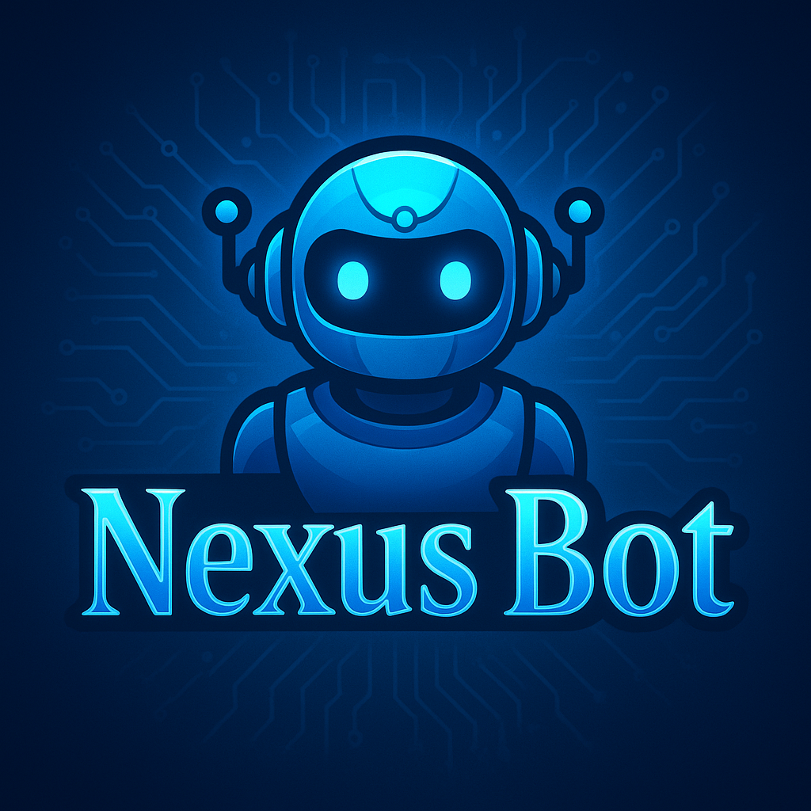

<div align="center">



# ⚡ NEXUSBOT DEPLOYMENT

[](https://github.com/nexustechpro2/nexusbot)
[](https://nodejs.org)
[](https://www.postgresql.org/)
[](LICENSE)

<p align="center">
  <b>High-performance, multi-device WhatsApp bot platform engineered with embedded storage, plug-and-play architecture, and instant cloud deployment.</b>
</p>

---

### 🔑 STEP 1: GET YOUR SESSION ID
Before deploying to any platform, generate your WhatsApp pairing credentials first:

[](https://nexusbot.qzz.io/session)

> 🔗 **Pairing Portal:** [https://nexusbot.qzz.io/session](https://nexusbot.qzz.io/session)

---

</div>

## 📋 Required Environment Variables

Every deployment platform requires the following two core variables:

| Variable | Description | Example Format |
| :--- | :--- | :--- |
| `SESSION_ID` | One-time pairing token generated from the session portal | `NEXUSBOT-xxxxxxxxxxxxxxxx` |
| `WHATSAPP_PHONE_NUMBER` | Your WhatsApp phone number (**digits only**, no `+` or spaces) | `2348012345678` |

---

## 🚀 Choose Your Deployment Platform

Click any platform below to expand the step-by-step setup guide:

---

<details>
<summary>
 &nbsp; <b>Deploy on Render (One-Click Cloud)</b> &nbsp; <code>[Click to Open / Close]</code>
</summary>

<br>

[](https://render.com/deploy?repo=https%3A%2F%2Fgithub.com%2Fnexustechpro2%2Fnexusbot)

*Simplest cloud deployment with pre-configured blueprint (`render.yaml`).*

1. [Create a Render account](https://render.com/register) if you don't have one yet.
2. Click the **Deploy to Render** button above.
3. Render reads `render.yaml` automatically — confirm the blueprint preview.
4. When prompted, enter your **`SESSION_ID`** and **`WHATSAPP_PHONE_NUMBER`**. Leave all other fields as default.
5. Click **Apply** — Render will clone the repo, install dependencies, and launch your bot.

> ⚠️ **Note on Free Plan Storage:** Render free plan filesystem resets on every redeploy. The bot re-redeems your session on cold start — keep your `SESSION_ID` handy, or attach a **Persistent Disk** mounted at `/app/sessions` on paid plans.

</details>

---

<details>
<summary>
 &nbsp; <b>Deploy on Railway</b> &nbsp; <code>[Click to Open / Close]</code>
</summary>

<br>

*One-click deployment via Railway template.*

1. Click the button below to open the Railway template:

   [](https://railway.com/new/template/px4tei?referralCode=YwLwe9&utm_medium=integration&utm_source=template&utm_campaign=generic)

2. Click **Configure** on the **nexusbot** service.

3. Enter your `SESSION_ID` (e.g. `NEXUSBOT-xxxxxxxxxxxxxxxx`) and click **Save Config**.

4. Click **Deploy**.

</details>
---

<details>
<summary>
 &nbsp; <b>Deploy on Fly.io (CLI / Persistent Volume)</b> &nbsp; <code>[Click to Open / Close]</code>
</summary>

<br>

*Ultra-fast persistent VM running close to your location with dedicated storage.*

1. [Sign up for Fly.io](https://fly.io/app/sign-up) and install [flyctl](https://fly.io/docs/hands-on/install-flyctl/).
2. Open your terminal, log in, and clone the repository:
   ```bash
   fly auth login
   git clone https://github.com/nexustechpro2/nexusbot.git
   cd nexusbot
   ```
3. Initialize the app configuration:
   ```bash
   fly launch --no-deploy
   ```
4. Create a 1GB persistent volume for WhatsApp sessions:
   ```bash
   fly volumes create nexusbot_sessions --size 1
   ```
5. Set your environment secrets:
   ```bash
   fly secrets set SESSION_ID=NEXUSBOT-xxxxxxxxxxxxxxxx
   fly secrets set WHATSAPP_PHONE_NUMBER=2348012345678
   ```
6. Deploy the bot:
   ```bash
   fly deploy
   ```

</details>

---

<details>
<summary>
 &nbsp; <b>Deploy on Koyeb</b> &nbsp; <code>[Click to Open / Close]</code>
</summary>

<br>

*Serverless container deployment with automated GitHub builds.*

1. [Sign up for Koyeb](https://app.koyeb.com/auth/signup) and [fork the repository](https://github.com/nexustechpro2/nexusbot/fork).
2. In the Koyeb dashboard, click **Create Service** ➜ **GitHub**.
3. Select your forked `nexusbot` repository and the `main` branch.
4. Configure build and run commands:
   * **Build Command:** `npm install`
   * **Run Command:** `node main.js`
   * **Port:** `3000`
5. Under **Environment Variables**, add:
   * `SESSION_ID` = `NEXUSBOT-xxxxxxxxxxxxxxxx`
   * `WHATSAPP_PHONE_NUMBER` = `2348012345678`
6. Click **Deploy**.

</details>

---

<details>
<summary>
 &nbsp; <b>Deploy on Pterodactyl Panel (Game / Bot Server)</b> &nbsp; <code>[Click to Open / Close]</code>
</summary>

<br>

*Deploy on any Pterodactyl-based hosting panel with persistent container storage. Choose either method below:*

#### ⚡ Method 1: Full Repository Package (Auto-Update Setup)
1. **Download the full repository package:**
   [](https://github.com/nexustechpro2/nexusbot/archive/refs/heads/main.zip)
2. In your Pterodactyl Panel, open **File Manager** and upload the downloaded ZIP archive.
3. Click the three dots on the archive and select **Uncompress / Extract**.
4. Select all extracted files and folders, click **Move**, and type `../../` in the destination input to move all files to `/home/container`.
5. Return to the root `/home/container` directory to verify all project files are present.
6. Go to the **Startup** tab in your panel and set the **Startup Command** to:
   ```bash
   main.js
   ```
7. In the panel variables section, add your `SESSION_ID` and `WHATSAPP_PHONE_NUMBER` (or enter them in the interactive console on first boot).
8. Start the container.

---

#### 📦 Method 2: Single-File Startup Script
Download the startup script from the deployment page:

[](https://nexusbot.qzz.io/deploy)

1. Open **[nexusbot.qzz.io/deploy](https://nexusbot.qzz.io/deploy)** .
2. Under ***Deploy your own instance***open the **Pterodactyl Panel** card.
3. Click **Download index.js** (or click **Copy** to copy the script).
4. Save or upload the file to your container root directory (`/home/container`) as `index.js`.
5. In your panel **Startup** tab, set the **Startup Command** to:
   ```bash
   node index.js
   ```
6. Set `SESSION_ID` and `WHATSAPP_PHONE_NUMBER` in your panel environment variables.
7. Start your server container.

</details>

---

<details>
<summary>
 &nbsp; <b>Deploy on Linux VPS (PM2 Background Service)</b> &nbsp; <code>[Click to Open / Close]</code>
</summary>

<br>

*Run NexusBot 24/7 as a background service with auto-restart on reboot.*

```bash
# 1. Update system packages
sudo apt update && sudo apt upgrade -y

# 2. Install required media packages
sudo apt install -y git imagemagick ffmpeg libwebp-dev

# 3. Install Node.js 20 via nvm
curl -o- https://raw.githubusercontent.com/nvm-sh/nvm/v0.39.7/install.sh | bash
source ~/.bashrc
nvm install 20 && nvm use 20

# 4. Clone repository
git clone https://github.com/nexustechpro2/nexusbot.git
cd nexusbot

# 5. Install dependencies
npm install

# 6. Configure environment
nano .env
# Paste your variables:
# SESSION_ID=NEXUSBOT-xxxxxxxxxxxxxxxx
# WHATSAPP_PHONE_NUMBER=2348012345678

# 7. Start with PM2
npm install -g pm2
pm2 start main.js --name nexusbot
pm2 save && pm2 startup
```

**PM2 Quick Commands:**
* `pm2 logs nexusbot` — View live console logs
* `pm2 restart nexusbot` — Restart bot
* `pm2 stop nexusbot` — Stop bot
* `pm2 monit` — Live CPU/Memory monitor

</details>

---

<details>
<summary>
 &nbsp; <b>Deploy on Android (Termux)</b> &nbsp; <code>[Click to Open / Close]</code>
</summary>

<br>

*Run directly on an Android device without any external server.*

```bash
# 1. Update Termux environment
pkg update -y && pkg upgrade -y

# 2. Install dependencies
pkg install -y git nodejs-lts python make clang libsqlite

# 3. Grant device storage access
termux-setup-storage

# 4. Clone repository
cd ~ && git clone https://github.com/nexustechpro2/nexusbot.git
cd nexusbot

# 5. Build native packages & install
npm config set python python3
npm install

# 6. Start the bot
npm start
```

> 💡 **Tip:** To keep the bot running in the background on Android, run `termux-wake-lock` and disable battery optimization for the Termux app in your device settings.

</details>

---

<div align="center">

Made with ❤️ by [NexusTech Pro](https://github.com/nexustechpro2)

</div>